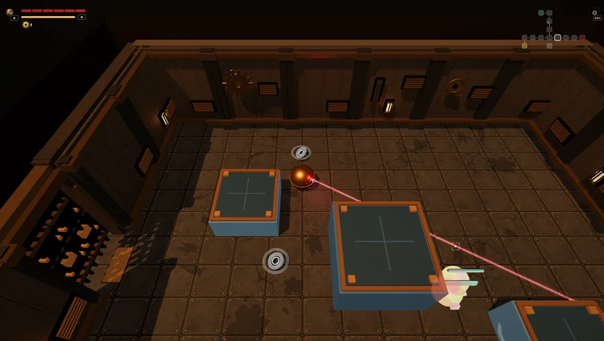
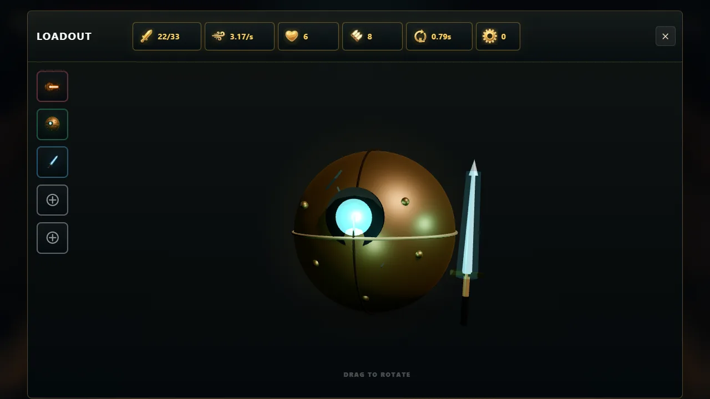
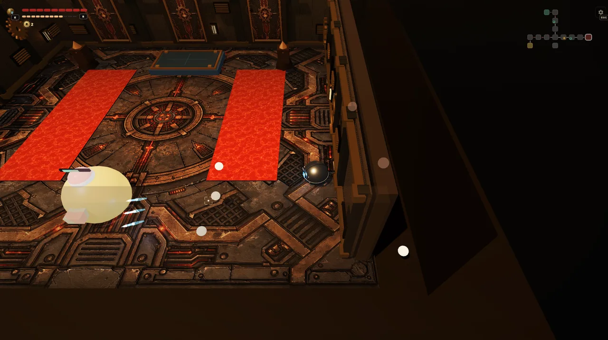
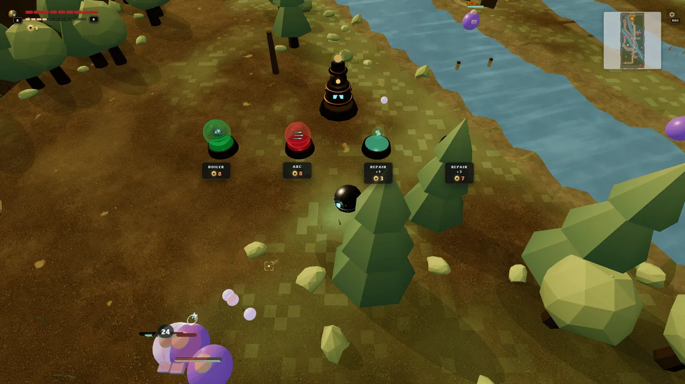

# Orb Knight

Break out of the machine. Reach the castle road.

[Play the live demo](https://eugenedraitsev.itch.io/orb-knight)

Orb Knight is a browser-only SvelteKit action game about a tiny brass machine
with a sword, a gun, and a suspicious amount of dungeon machinery. Fight through
procedural foundry rooms, collect gears, rebuild your loadout, and push toward
the castle road.

## Screenshots










## What is in the demo

- Third-person 3D action built with SvelteKit, Threlte, Three.js, and Rapier.
- Seeded dungeon runs with room transitions, pickups, shops, treasure rooms, and
  boss encounters.
- A machine loadout system with attack, body, utility, and melee modules.
- Gear currency, healing pickups, artifact rewards, and persistent run progress.
- Runtime settings for camera, lighting, physics, graphics, audio, and combat
  feel.
- Storybook playgrounds for fast combat, room, player, and UI iteration.

## Controls

| Action | Input |
| --- | --- |
| Move | WASD or arrow keys |
| Shoot | Left mouse button |
| Sword | Right mouse button or F |
| Jump | Space |
| Loadout | E |
| Settings | Esc |

## Tech Stack

- SvelteKit with SSR disabled for browser-only gameplay
- Svelte 5 runes
- Threlte and Three.js for rendering
- Rapier for physics
- Bun for scripts and package management
- Vitest, svelte-check, and Ultracite for verification
- Storybook for focused gameplay sandboxes

## Run Locally

```sh
bun install
bun run dev
```

## Useful Commands

```sh
bun run check
bun run test
bun run storybook
bun run build
```

Production deploys use:

```sh
bun run vercel-build
```

That command builds Storybook into `static/storybook` before the app build, so
the deployed `/storybook` route can serve the static bundle.

## License

MIT
